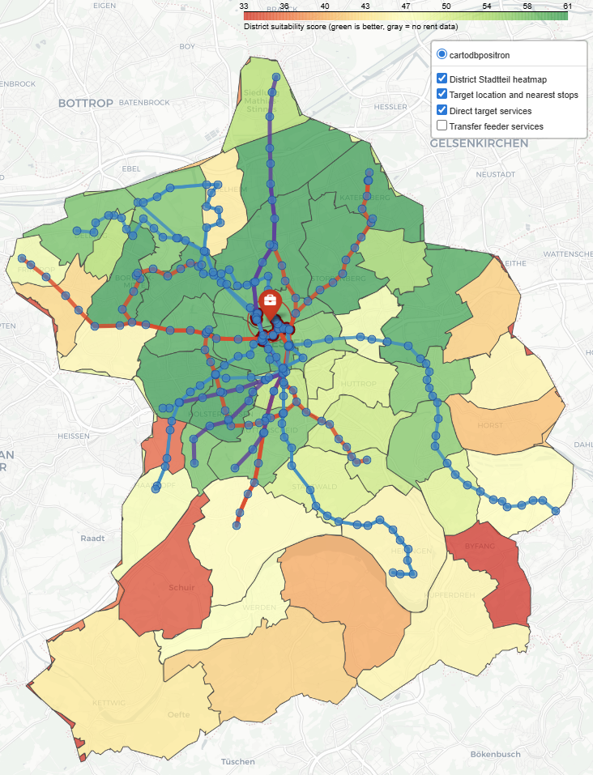

# Find the Best Areas to Rent Based on Your Preferences

This project helps to shortlist German Stadtteile (districts/district quarters) around one target (workplace or study) location and rank nearby Stadtteile according to personal preferences. It does not give door-to-door commute or live-rental-market data. The project was built for getting an initial answer for "I got a job in a new city at location XY. Now, I wonder which of the neighboring areas should I prioritize to look for rental accommodation?"

It combines:
- rent data from Census
- public transport schedules
- OSM-derived neighborhood quality signals

The final result is a ranked Stadtteile list based on your target location plus an interactive map.

## Core Input and Output

The required config files that need to be edited before running the pipeline and the core outputs are:

- `config/commute_defaults.json`
  Main settings for the target location, commute window, and preference weights.
- `config/commute_preset_*.json`
  Ready-made preference presets such as balanced, budget-first, and commute-first.
- `outputs/maps/commute_district_heatmap_stdt.html`
  Main interactive output map.
- `data/processed/commute_ranking_by_workplace_stdt.csv`
  Final ranked shortlist.

## The Pipeline Description

The workflow builds the result in five stages.

1. Rent base
- script: `src/01_build_rent_by_stdt.py`
- purpose: aggregates the 100m rent grid to Stadtteil level
- main outputs:
  - `data/processed/rent_by_stdt.csv`
  - `data/processed/rent_by_stdt.gpkg`

2. Transit base
- script: `src/02_integrate_gtfs_by_stdt.py`
- purpose: adds Stadtteil-level General Transit Feed Specification (GTFS) transit supply metrics
- main outputs:
  - `data/processed/rent_transit_by_stdt.csv`
  - `data/processed/rent_transit_by_stdt.gpkg`

3. OSM quality base
- script: `src/03_integrate_osm_quality_by_stdt.py`
- purpose: adds green-space, street-tree, supermarket, and hospital quality metrics
- main outputs:
  - `data/processed/rent_transit_quality_by_stdt.csv`
  - `data/processed/rent_transit_quality_by_stdt.gpkg`

1. Commute computation
- script: `src/04_compute_commute_options_by_target_stdt.py`
- purpose: computes all target-specific commute options for the current routing profile and stores in cache
- main output:
  - `data/processed/commute_compute_cache_stdt/`
- why it exists: this is the heavy stage, so later ranking reruns are faster

5. Final ranking and map
- script: `src/05_rank_commute_locations_by_workplace_stdt.py`
- purpose: applies user preferences to the cached commute options and writes the final outputs
- main outputs:
  - `data/processed/commute_ranking_by_workplace_stdt.csv`
  - `data/processed/commute_district_stdt.geojson`
  - `outputs/maps/commute_district_heatmap_stdt.html`

## Inputs

Only the major inputs are listed here.

These links are provided so users can obtain the input data themselves. The repository does not bundle those third-party datasets.
### 1. Rent data
- file: `input/rental_price/Zensus 2022 - Kaltmieten.geojson`
- what it is: the Germany-wide 100m rent grid used as the rent backbone
- source:
  - `https://goat.plan4better.de/map/public/cb10a6a9-0c94-4958-bf25-9e167e4c3c31`
- Note: Zoom-in until you see the Rent 100x100m layer and then download. Please review any terms attached to that source.

### 2. GTFS schedule data
- folder: `input/gtfs/`
- what it is: Germany GTFS public transport feed tables
- required files:
  - `agency.txt`
  - `stops.txt`
  - `routes.txt`
  - `trips.txt`
  - `calendar.txt`
  - `calendar_dates.txt`
  - `stop_times.txt`
- source:
  - `https://gtfs.de/en/feeds/`
- Note: GTFS.de provides data for 30 days, please adjust the config file based on the data you got. The model works with the Germany-wide dataset, but filters out the long-distance transports such as ICE, DBRegio etc. The mentioned provider publishes the data under a Creative Commons 4.0 License.


### 3. OSM source file
- file: `input/osm/germany-latest.osm.pbf`
- what it is: Germany-wide OSM extract used for Stadtteil generation and OSM quality metrics
- source:
  - `https://download.geofabrik.de/europe/germany.html`
- Note: OpenStreetMap data is © OpenStreetMap contributors and is typically distributed under the ODbL.

### 4. NUTS3 boundaries
- file: `input/nuts3_shapes/NUTS_RG_01M_2024_3035.gpkg`
- what it is: district boundaries used to detect which district contains the target coordinate (CRS EPSG: 3035 is better for this project)
- source:
  - `https://ec.europa.eu/eurostat/web/gisco/geodata/statistical-units/territorial-units-statistics`
- Note: use the official GISCO download page for the exact boundary package used by this workflow.

### 5. OSM extraction config files
- files:
  - `config/osmconf_stadtteile.ini`
  - `config/osmconf_quality.ini`
- Note: project-owned extraction configs for `ogr2ogr`

## Installation

Clone the repo to your local <repo_root>.

Run everything from the local repository root:

```powershell
cd <repo_root>
```

Install Python dependencies:

```powershell
python -m venv .venv
.venv\Scripts\Activate.ps1
python -m pip install --upgrade pip
pip install -r requirements.txt
```

### External Tools Needed

Stages `01` and `03` require:
- `osmium`
- `ogr2ogr`

They are not installed by `requirements.txt`.

### Recommended run instructions for Windows:

1. Install Miniconda or Miniforge.
2. Create a small tools environment:

```powershell
conda create -n geo-tools -c conda-forge gdal osmium-tool -y
```

3. Activate it:

```powershell
conda activate geo-tools
```

4. Verify the commands exist:

```powershell
osmium --version
ogr2ogr --version
```

5. From that same shell, run the repo scripts with the repo Python (after setting the `Config Settings`, otherwise you will have to run things again):

```powershell
cd <repo_root>
.\.venv\Scripts\python.exe src\01_build_rent_by_stdt.py
.\.venv\Scripts\python.exe src\02_integrate_gtfs_by_stdt.py
.\.venv\Scripts\python.exe src\03_integrate_osm_quality_by_stdt.py
.\.venv\Scripts\python.exe src\04_compute_commute_options_by_target_stdt.py
.\.venv\Scripts\python.exe src\05_rank_commute_locations_by_workplace_stdt.py
```

This environment split was unnecessary but was kept for the convenience of not using WSL only for the external tools, so now:
- Conda provides the external command-line GIS tools
- `.venv` provides the repo's Python packages
- no WSL is needed


## When You Need To Rerun Which Stage

- If you only changed preference weights or switched presets: rerun stage `05`
- If you changed the target coordinate, date, arrival window, transfer radius, or transfer timing rules: rerun stages `04` and `05`
- If you changed OSM quality logic or the OSM source file: rerun stages `03`, `04`, and `05`
- If you changed GTFS inputs: rerun stages `02`, `03`, `04`, and `05`
- If you changed rent inputs or Stadtteil generation logic: rerun `01 -> 05`

## Config Settings

Main file:
- `config/commute_defaults.json`

Most important keys:

- `workplace_coordinate`
  The target location in `latitude, longitude` format (just copy-paste the target location from Google maps)
- `date`
  GTFS service date used for the commute search (set it from your downloaded GTFS files, as they update it regularly).
- `arrival_start`, `arrival_end`
  Preferred arrival window at work.
- `max_workplace_stop_distance_m`
  Maximum distance from the workplace coordinate to a destination stop (how much are you willing to walk; larger radius is likely to result in more stops with direct services).
- `max_transfers`
  Maximum number of allowed transfers in final route filtering (the more transfers you allow, the more complex the model and your life will be)
- `transfer_radius_m`
  Preferred transfer radius for connecting nearby stops.
- `min_transfer_radius_m`, `max_transfer_radius_m`
  Config-driven bounds that clamp `transfer_radius_m`.
- `min_transfer_min`, `max_transfer_wait_min`
  Minimum and maximum transfer waiting time
-  `typical_size_m2` 
   Apartment size used only for estimated monthly cold-rent display (as an indication, not an offer-price.

The preference weight assignments (can be set from 0...10; setting 0 will make the model completely ignore the parameter and 10 will give it the highest preference):

- `transfer_hate`
  How strongly transfers are disliked in both routing and final scoring.
- `rent_importance`
  How much affordability matters in the final score.
- `time_importance`
  How much travel time matters.
	- Note: Travel time is only based on the GTFS data, real-world delays are not computed.
- `frequency_importance`
  How much the transport service richness matters (e.g., bus/train every 10 minutes or 20 minutes)
- `green_space_importance`
  How much urban green-ness matters.
- `supermarket_importance`
  How much supermarket presence matters.
- `hospital_importance`
  How much hospital presence matters.

Preset files as example:
- `config/commute_preset_balanced.json`
- `config/commute_preset_budget_first.json`
- `config/commute_preset_commute_first.json`
- `config/commute_preset_family_friendly.json`

Use a preset like this:

```powershell
.\.venv\Scripts\python.exe src\05_rank_commute_locations_by_workplace_stdt.py --config config\commute_preset_commute_first.json
```

## Methodology

This section explains exactly how the model is built and what each stage contributes.

### 1. Spatial unit

The ranking unit is the `Stadtteil`.

Why this unit is used:
- it is more interpretable than a 100m grid for a user choosing where to live
- it is more fine-grained than PLZ for intra-city differences
- it is still large enough to support initial area screening before a user has a precise address

### 2. Rent methodology

Stage `01` aggregates the Zensus 2022 100m rent grid to each Stadtteil polygon.

The main affordability variable is:

```text
median_rent_per_m2
```

This is preferred over a mean because it is less sensitive to local outliers.

An additional display-only value is derived as:

```text
estimated_monthly_rent_typical = median_rent_per_m2 * typical_size_m2
```

This estimated monthly rent is for interpretation only. It does not directly drive the ranking.

#### Key Note: The rent data should not be taken as absolute value! This is cold-rent statistical data from 2022 Census. It provides a distribution of rental offer prices only.

### 3. GTFS transit base methodology

Stage `02` builds Stadtteil-level transit supply metrics. These are not yet workplace-specific commute results.

Examples of stage-2 supply metrics:
- stop count
- route count
- departures per day
- rail and local-transit departure volumes

These metrics describe how much transit supply exists in the Stadtteil overall.

### 4. OSM quality methodology

Stage `03` computes area-quality metrics from the OSM data that later enter the final scoring.

Current green and amenity metrics kept in the runtime model:
- `green_space_share`
- `green_space_patch_density_km2`
- `street_tree_density_km2`
- `supermarket_count`
- `hospital_count`

Definitions:

```text
green_space_share = green_space_area_within_stadtteil / stadtteil_area
```

Meaning:
- higher values indicate that a larger share of the Stadtteil polygon is mapped as green land such as park, forest, grass, meadow, or wood

```text
green_space_patch_density_km2 = green_space_count / stadtteil_area_km2
```

Meaning:
- higher values indicate greener distribution across the area rather than only one large green polygon

```text
street_tree_density_km2 = street_tree_count / stadtteil_area_km2
```

Meaning:
- higher values indicate more mapped urban trees or tree rows per km²

```text
supermarket_count = number of mapped supermarkets within the Stadtteil
```

```text
hospital_count = number of mapped hospitals within the Stadtteil
```

Important limitation:
- `hospital_count` currently reflects mapped hospitals, not all clinics or all healthcare facilities

### 5. Commute computation methodology

Stage `04` computes target-specific commute options and stores them in a cache to facilitate faster preference-based reruns.

This stage uses:
- target coordinate
- chosen service date
- commute window
- Stops nearby the target search radius
- transfer radius
- minimum transfer time
- maximum transfer wait
- maximum transfer count used for search

The compute stage builds:
- direct commute options
- transfer commute options

It computes up to:

```text
computed_max_transfers = max(3, configured_max_transfers)
```

This is done so stage `05` can filter down to a lower allowed transfer count without recomputing the full search.

### 6. Route selection logic

Before Stadtteile are ranked, the model first selects practical commute options.

For route selection, the generalized cost is:

```text
commute_generalized_cost = travel_time_min + transfer_count * transfer_penalty_min
```

with:

```text
transfer_penalty_min = transfer_hate
```

Meaning:
- longer travel time is worse
- more transfers are worse
- higher `transfer_hate` makes transfer-heavy routes less likely to be selected as the representative commute options

This route-selection penalty is separate from the final Stadtteil ranking formula.

### 7. Stadtteil aggregation logic

After feasible commute options are built, the model aggregates them to Stadtteil level.

It uses area-wide signals such as:
- `best_travel_time_min`
- `best_transfer_count`
- `direct_line_count`
- `useful_line_count_total`
- `unique_departure_minutes_per_hour`
- `latest_departure_time`
- transfer robustness metrics from the selected transfer patterns

This means the ranking tries to represent the quality of the Stadtteil as an area based on the commute quality to target location.

### 8. Normalization logic

The final scoring uses district-relative normalization.

For each detected district, each metric is scaled to the `0..1` range:

```text
normalize(x) = (x - min_district_value) / (max_district_value - min_district_value)
```

Then the model converts raw metrics into “goodness” directions.

Examples:

```text
rent_good = 1 - normalize(median_rent_per_m2)
travel_good = 1 - normalize(best_travel_time_min)
```

Meaning:
- cheaper rent gives a higher `rent_good`
- shorter travel time gives a higher `travel_good`

For count-like amenity variables, the model softens scale differences using `log1p` before normalization.

Examples:

```text
supermarket_good = normalize(log(1 + supermarket_count))
hospital_good = normalize(log(1 + hospital_count))
```

This prevents very large raw counts from dominating too strongly.

### 9. Frequency dimension

The model does not rank a Stadtteil mainly by one stop's frequency.

Instead, the frequency dimension combines the following parameters for the target location:
- direct line count
- useful line count
- unique departure-minute coverage
- latest feasible departure

Conceptually:

```text
frequency_good = average(
  normalized_direct_line_count,
  normalized_useful_line_count,
  normalized_unique_departure_minutes,
  normalized_latest_departure
)
```

Meaning:
- more line diversity is better
- broader departure coverage is better
- being able to leave later and still arrive on time is better

### 10. Transfer dimension

The transfer dimension is not just “fewer transfers”.

It combines:
- transfer count
- downstream direct-line richness after transfer
- downstream direct-minute richness after transfer
- transfer wait quality

Conceptually:

```text
transfer_good = average(
  transfer_count_good,
  transfer_robustness_good,
  transfer_wait_good
)
```

Meaning:
- fewer transfers are better
- transfer stops with richer downstream service are better
- shorter and more practical waits are better

### 11. Green dimension

The current green dimension combines three lighter-weight signals:

```text
green_space_good = average(
  normalize(green_space_share),
  normalize(log1p(green_space_patch_density_km2)),
  normalize(log1p(street_tree_density_km2))
)
```

Meaning:
- broad green land share matters
- greener distribution across the area matters
- mapped urban tree presence matters

### 12. Final ranking equation

The final Stadtteil score is:

```text
ranking_score =
100 * (
    rent_good        * rent_importance
  + travel_good      * time_importance
  + frequency_good   * frequency_importance
  + transfer_good    * transfer_hate
  + green_space_good * green_space_importance
  + supermarket_good * supermarket_importance
  + hospital_good    * hospital_importance
) / total_weight
```

where:

```text
total_weight =
    rent_importance
  + time_importance
  + frequency_importance
  + transfer_hate
  + green_space_importance
  + supermarket_importance
  + hospital_importance
```

Meaning:
- every top-level dimension is normalized first
- user preferences act as explicit weights on those normalized dimensions
- higher `ranking_score` is better

### 13. Missing-data handling

If rent data is missing for a Stadtteil:
- the Stadtteil can still appear on the map
- commute and amenity metrics can still be shown
- but the Stadtteil is not given a normal ranking score

This avoids pretending to know affordability when the rent base is missing.

### 14. Practical interpretation

This model is best understood as a screening tool.

It helps answer:
- which Stadtteile are promising enough to inspect further
- which areas balance affordability and commute quality better under the current user preferences

It does not replace final listing-level validation in a door-to-door routing tool.

## What The Ranking Actually Means

The final ranking tries to answer:
- which Stadtteile are most attractive for this workplace,
- given the user’s balance of rent, commute quality, and neighborhood quality.

The main dimensions are:

- rent
  Lower rent per m² is better.
- travel time
  Shorter best feasible commute is better.
- frequency / service richness
  More useful lines, broader departure coverage, and later feasible departures are better.
- transfer quality
  Fewer transfers and stronger transfer opportunities are better.
- green quality
  Uses broad green area, distributed green patches, and street-tree density.
- supermarkets
  More supermarket presence is better.
- hospitals
  This currently counts mapped hospitals only, not all healthcare facilities.

Higher `ranking_score` is better.

## Key Output Files Explained

### `outputs/maps/commute_district_heatmap_stdt.html`
Main interactive map.

Shows:
- ranked Stadtteile in the detected district
- target location and nearby target stops
- direct target services
- transfer feeder services



### `data/processed/commute_ranking_by_workplace_stdt.csv`
Final ranked shortlist.

Useful columns:
- `district_rank`
  Position within the detected district.
- `ranking_score`
  Final combined score.
- `best_travel_time_min`
  Best feasible travel time found for that Stadtteil.
- `best_transfer_count`
  Transfer count of the best selected commute option.
- `unique_departure_minutes_per_hour`
  How much departure coverage exists in the time window.
- `useful_line_count_total`
  Number of useful line groups contributing to the commute profile.
- `latest_departure_time`
  Latest feasible departure that still reaches work on time.
- `score_summary`
  Short textual explanation of why the area ranks as it does.

### `data/processed/rent_transit_quality_by_stdt.csv`
Base Stadtteil feature table before target-specific commute ranking.

Useful columns:
- `median_rent_per_m2`
- `stop_count`
- `departures_per_day_avg`
- `green_space_share`
- `green_space_patch_density_km2`
- `street_tree_density_km2`
- `supermarket_count`
- `hospital_count`

## Missing Data Behavior

- If rent is missing, the Stadtteil still appears but is not given a normal ranking score.
- If commute data is missing, the Stadtteil can still appear in the district heatmap as a no-feasible-commute area.
- If both are missing, the geometry can still remain visible instead of disappearing.
- Gray areas on the final map usually indicate missing rent data rather than a routing failure.

## Troubleshooting

- If stage `01` fails during Stadtteil rebuild, check:
  - `input/osm/germany-latest.osm.pbf`
  - `config/osmconf_stadtteile.ini`
  - `osmium`
  - `ogr2ogr`
- If stage `02` fails, confirm all required GTFS files exist in `input/gtfs/`.
- If stage `03` fails, check:
  - `config/osmconf_quality.ini`
  - the OSM PBF path
  - that cached OSM layers are rebuilt with `--force-reparse` after OSM config changes
- If stage `04` fails, inspect the workplace coordinate, date, arrival window, and stop distance settings.
- If stage `05` says the commute cache is missing, rerun stage `04` with the same config.

Quick sanity checks:
- `data/processed/rent_transit_quality_by_stdt.gpkg` should exist before stages `04` and `05`
- `data/processed/commute_compute_cache_stdt/` should contain at least one profile folder before stage `05`
- `outputs/maps/commute_district_heatmap_stdt.html` is the main end-user output

## Caveats

- This is an area-screening workflow, not a final door-to-door routing tool. 
- Doe not compute walking time.
- GTFS results depend on the selected service date.
- Rent values are statistical area values from 2022, not live listing prices.
- `hospital_count` currently reflects mapped hospitals only, not all clinics or all healthcare facilities.
